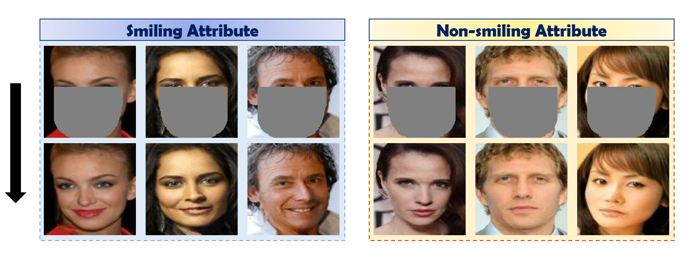
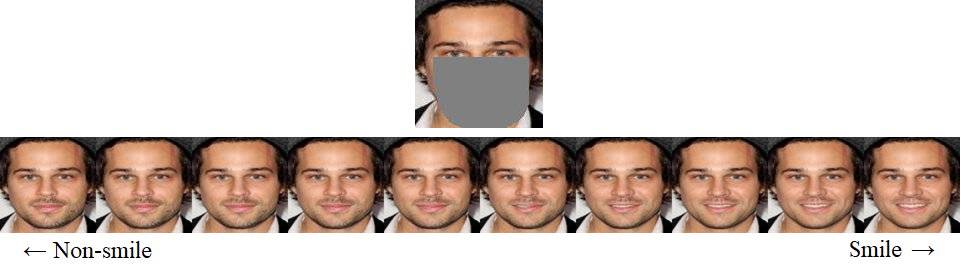

# Spatial-aware Attribute Controllable GAN for Image Inpainting
A PyTorch reimplementation for the paper [SAC-GAN : Face Image Inpainting with Spatial-aware Attribute Controllable GAN]. (ACCV 2022)

## Abstract 
The objective of image inpainting is refilling the masked area with semantically appropriate pixels and producing visually realistic images as an output. After the introduction of generative adversarial networks (GAN), many inpainting approaches are showing promising development. Several attempts have been recently made to control reconstructed output with the desired attribute on face images using exemplar images and style vectors. Nevertheless, conventional style vector has the limitation that to project style attribute representation onto linear vector without preserving dimensional information. We introduce spatial-aware attribute controllable GAN (SAC-GAN) for face image inpainting, which is effective for reconstructing masked images with desired controllable facial attributes with advantage of utilizing style tensors as spatial forms. Various experiments to control over facial characteristics demonstrate the superiority of our method compared with previous image inpainting methods.


## Instruction

<p align="center"></p>

Facial recognition model [Download](https://drive.google.com/file/d/1HuDJDlQtpUzW62tj_wkaeAUPU96wC_D4/view?usp=sharing) which needs to be put in **'models'** directory
This pre-trained model is trained on CASIA-WebFace and ArcFace using 128x128 image

Download and put the checkpt file into **'models'** directory.

```
$ mv CASIA_PRETRAINED.ckpt models/
```

## Example of dataset
1. We followed the datset settings from L2M-GAN(https://github.com/songquanpeng/L2M-GAN).
2. Prepare dataset should contains 'train' and 'test' folder
  - Class 1  
    - Train
        + image 1-1  
        + image 1-2
        ...    
        + image 1-n 
    - Test
        + image 1-1  
        + image 1-2
        ...    
        + image 1-n 
  - Class 2  
    - Train
        + image 2-1  
        + image 2-2
        ...    
        + image 2-n 
    - Test
        + image 2-1  
        + image 2-2
        ...    
        + image 2-n 

[Example of dataset (small)](https://drive.google.com/file/d/1s8Pq5fM02z3mS35k8sWv0ymcwjqZrJuM/view?usp=sharing)

# Masks

We included one custom binary mask 'face_mask.png'.
For random masks, we used mask generator fom DeepFill repository (https://github.com/zhaoyuzhi/deepfillv2)

* FIXED MASK 
In train.sh, if you set *'mask_type'* as **'FIX'**, set the binary mask file in argument 'fix_mask_path'.
We provide our two custom masks in mask/fix_mask.

* RANDOM MASK
In train.sh, if you set *'mask_type'* as **'RAND'**, set the binary mask file in argument 'rand_mask_path'.
However, to reduce time spent in mask generation, we pre-generated random masks.
First, generate random masks. To generate random masks, run mask/mask_generator.py.
Default number of generated masks is 100 and default save path is mask/random_masks.

```
$ python3.6 ./mask_codes/mask_generator.py --num 100 --path mask/random_masks
```


## Sample Inference

We have trained checkpoint file with 'smile' attribute using 'mask/fix_mask/half_unnder_big.png'.
Download [checkpoint file](https://drive.google.com/file/d/1BBmpVweF2uThi6Dkc18sZ7ZM9g07eK7S/view?usp=sharing) and put *smile_fix* directory into **'expr'** directory.
Download [sample dataset](https://drive.google.com/file/d/1s8Pq5fM02z3mS35k8sWv0ymcwjqZrJuM/view?usp=sharing) linked above which contains few samples of images about smiling attribute and put *celeba_smile_sample* directory into **'archive'** directory.

```
$ unzip smile_ckpt.zip
$ mv smile_fix ./expr/
$ unzip sample_db.zip
$ mv celeba_smile_sample ./archive/
$ ./scripts/sample.sh
```

Then, the samples will be saved under 'expr/smile_fix/samples/YYYY-MM-DD_HH-MM-SS'

* Non-smile -> Smile

Check *'expr/smile_fix/samples/YYYY-MM-DD_HH-MM-SS/non_smile2smile'* directory for the results. Also input masked images will be saved in *'expr/smile_fix/samples/YYYY-MM-DD_HH-MM-SS/non_smile2smile/masked'* directory.

* Smile -> Non-smile

Check *'expr/smile_fix/samples/YYYY-MM-DD_HH-MM-SS/smile2non_smile'* directory for the results. Also input masked images will be saved in *'expr/smile_fix/samples/YYYY-MM-DD_HH-MM-SS/smile2non_smile/masked'* directory.

<p align="center"></p>

You can train and generate image using other attributes by placing images like that.


## training
Modify config.py or scripts/train.sh file to change argument or options.
The sample dataset we linked above is **Insufficient** for training so prepare your custom dataset from CelebA or FFHQ dataset.

```
$ ./scripts/train.sh
```

* About GPU
In the top line of 'train.sh' file, note that 'CUDA_VISIBLE_DEVICES' means your real GPU ids which you want to make visible and '--gpus' means index of GPUs that you enabled as 'visible'.
  * Assume you have 4 GPUs and want to use 3rd, 4th GPUs for training. Then set shell file as 'CUDA_VISIBLE_DEVICES=2,3' and '--gpus='0,1''. 
  * Assume you have 1 GPU and want to use it for training. Then set shell file as 'CUDA_VISIBLE_DEVICES=0' and '--gpus='0''.

<p align="center"></p>

## Acknowledgement
 + Most functions are brought from L2M-GAN(https://github.com/songquanpeng/L2M-GAN).
 + This work was supported by Institute of Information & communications Technology Planning & Evaluation(IITP) grant funded by the Korea government(MSIT)(No.2017-0-00897, Development of Object Detection and Recognition for Intelligent Vehicles) and (No.B0101-15-0266, Development of High Performance Visual BigData Discovery Platform for Large-Scale Realtime Data Analysis)